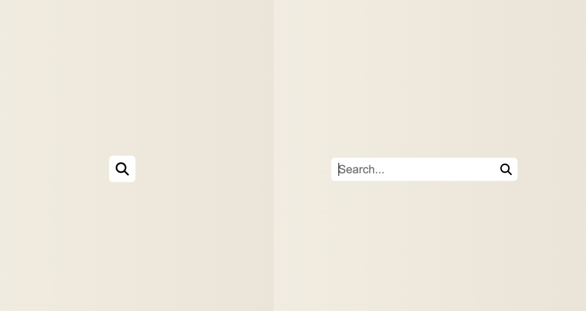

# Hidden Search

    <a href="https//www.mia-hidden-search.netlify.app">Live Demo</a>

[50days50projects](https://github.com/bradtraversy/50projects50days)第四天的练习：Hidden Search

---
## What I Learned
1. CSS: `element.classList.toggle(class)`**表示如果类不存在就添加类，存在就移除它**。这样就能实现点击一次搜索图标展开搜索框，再点击一次搜索框会收起搜索框变成搜索图标。